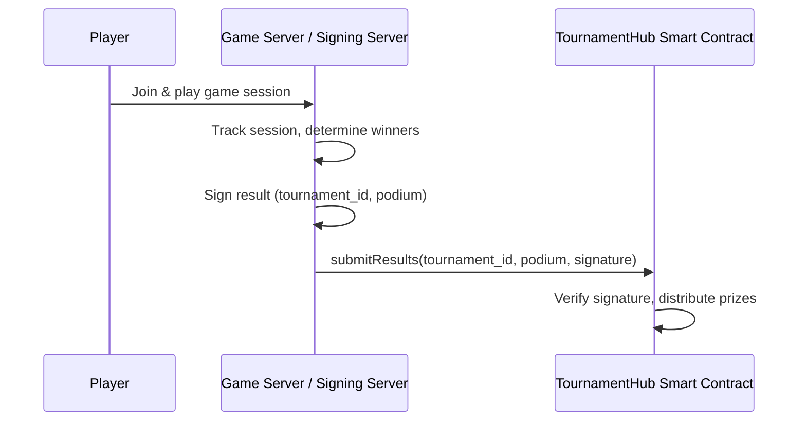
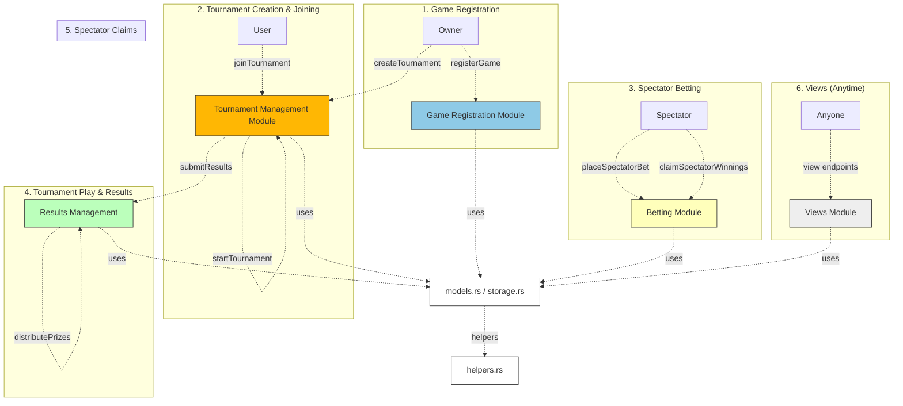

# Tournament Hub

A comprehensive blockchain-based tournament platform built on MultiversX, featuring multiple game engines, real-time multiplayer gameplay, and decentralized prize distribution. The platform consists of three main components: a React frontend, a Python game server, and a Rust smart contract.

## Architecture Overview

The Tournament Hub follows a three-tier architecture:

```
┌─────────────────────────────────────────────────────────────┐
│                    Frontend (React/TypeScript)              │
│  • Tournament Management UI                                 │
│  • Real-time Game Interfaces                               │
│  • Wallet Integration (MultiversX Web Wallet)              │
│  • Tournament Statistics & Analytics                       │
└─────────────────────────────────────────────────────────────┘
                                │
                                ▼
┌─────────────────────────────────────────────────────────────┐
│                  Game Server (Python/FastAPI)              │
│  • Multiplayer Game Engines (Chess, TicTacToe, etc.)      │
│  • Real-time Game State Management                         │
│  • Result Signing & Verification                           │
│  • Tournament Session Management                           │
└─────────────────────────────────────────────────────────────┘
                                │
                                ▼
┌─────────────────────────────────────────────────────────────┐
│                Smart Contract (Rust/MultiversX)            │
│  • Tournament Lifecycle Management                         │
│  • Prize Distribution & House Fees                         │
│  • Spectator Betting System                                │
│  • Secure Result Verification                              │
└─────────────────────────────────────────────────────────────┘
```

## Project Structure

```
tournament-hub/
├── tournament-hub-frontend/     # React frontend application
├── tournament-hub-game-server/  # Python game server with engines
└── tournament-hub-sc/          # Rust smart contract
```

## Frontend (React/TypeScript)

The frontend is built with React, TypeScript, and Chakra UI, providing a modern and responsive user interface.

### Key Features
- **Tournament Management**: Create, join, and manage tournaments
- **Real-time Game Interfaces**: Interactive game components for all supported games
- **Wallet Integration**: Seamless MultiversX Web Wallet connection
- **Tournament Analytics**: Statistics, leaderboards, and performance tracking
- **Responsive Design**: Mobile-first approach with modern UI/UX

### Main Pages
- **Home**: Dashboard with tournament statistics and upcoming tournaments
- **Tournaments**: Browse and filter active tournaments
- **Tournament Details**: Detailed view with participants, brackets, and betting
- **Create Tournament**: Tournament creation form with game selection
- **Dashboard**: Personal statistics and tournament history
- **Game Session**: Real-time multiplayer game interface

### Game Components
- **ChessGamePro**: Advanced chess interface with move validation
- **TicTacToeGame**: Classic tic-tac-toe multiplayer
- **ColorRush**: Fast-paced color matching game
- **CryptoBubblesGame**: Phaser.js-based bubble popping game
- **DodgeDash**: Arcade-style dodging game

### Technology Stack
- React 18 with TypeScript
- Chakra UI for components
- React Router for navigation
- MultiversX SDK for blockchain interaction
- Phaser.js for game engines
- Axios for API communication

## Game Server (Python/FastAPI)

The game server handles real-time multiplayer gameplay, result determination, and secure result submission to the blockchain.

### Supported Games
1. **Chess** - Full chess implementation with move validation
2. **Tic Tac Toe** - Classic 3x3 grid game
3. **Color Rush** - Fast-paced color matching puzzle
4. **CryptoBubbles** - Bubble popping arcade game
5. **DodgeDash** - Arcade-style obstacle dodging

### Key Features
- **Real-time Game State Management**: WebSocket-based communication
- **Result Signing**: ECDSA signature generation for secure result submission
- **Session Management**: Tournament session lifecycle management
- **Game Engine Integration**: Modular game engine architecture
- **Database Optimization**: SQLite with performance optimizations

### API Endpoints
- Game session management (`/start_session`, `/end_session`)
- Game state queries (`/chess_game_state`, `/tictactoe_game_state`, etc.)
- Result submission (`/submit_results`)
- Public key management (`/public_key_pem`)

## Smart Contract (Rust/MultiversX)

The smart contract manages tournament lifecycle, prize distribution, and spectator betting on the MultiversX blockchain.

### Project Structure

```
tournament-hub-sc/
├── src/
│   ├── helpers.rs              # Private helper functions used across modules
│   ├── models.rs               # Data structures and enums (GameConfig, Tournament, etc.)
│   ├── storage.rs              # Storage mappers for contract state
│   ├── views.rs                # View (query) endpoints
│   ├── tournament_hub.rs       # Main contract trait, only init/upgrade logic and trait composition
│   └── tournament_logic/
│       ├── game_registration.rs      # Game registration endpoints
│       ├── tournament_management.rs # Tournament creation, joining, starting
│       ├── results_management.rs    # Result submission and prize distribution
│       └── spectator_betting.rs     # Spectator betting and claims
└── README.md
```

### Module Overview

- **models.rs**: Contains all core data structures and enums, such as `GameConfig`, `Tournament`, `TournamentStatus`, etc.
- **storage.rs**: Defines storage mappers for persistent contract state (games, tournaments, bets, etc.).
- **helpers.rs**: Private helper functions for internal contract logic (e.g., signature verification, prize distribution).
- **views.rs**: Read-only endpoints for querying contract state (game config, tournament info, bets, etc.).
- **tournament_logic/**: Contains logic modules for each major contract feature:
  - **game_registration.rs**: Endpoints for registering new games (owner only).
  - **tournament_management.rs**: Endpoints for creating, joining, and starting tournaments.
  - **results_management.rs**: Endpoints for submitting results and distributing prizes.
  - **spectator_betting.rs**: Endpoints for placing bets and claiming winnings as a spectator.
- **tournament_hub.rs**: The main contract file. It only contains the contract trait, which composes all modules, and the `init`/`upgrade` functions.

### Smart Contract Endpoints

#### Tournament Management
- `createTournament` - Create a new tournament with entry fee
- `joinTournament` - Join an existing tournament
- `startGame` - Start a tournament game session
- `getTournament` - Get tournament details
- `getActiveTournamentIds` - Get list of active tournament IDs

#### Game Registration
- `registerGame` - Register a new game type (owner only)
- `getGameConfig` - Get game configuration
- `getNumberOfGames` - Get total number of registered games

#### Results Management
- `submitResults` - Submit tournament results with signature verification
- `updateResultTxHash` - Update result transaction hash
- `getPrizePool` - Get current prize pool for a tournament

#### Spectator Betting
- `placeSpectatorBet` - Place a bet on a tournament participant
- `claimSpectatorWinnings` - Claim betting winnings
- `getSpectatorBets` - Get spectator bets for a tournament
- `getSpectatorPoolTotal` - Get total spectator betting pool

#### View Functions
- `getUserTournaments` - Get tournaments for a specific user
- `getUserStats` - Get user statistics
- `getNumberOfTournaments` - Get total number of tournaments
- `getAccumulatedHouseFees` - Get accumulated house fees

### Key Features

- **Modular Design**: Each logical area is in its own file, making the codebase easy to navigate and extend.
- **Owner-Only Game Registration**: Only the contract owner can register new games.
- **Tournament Lifecycle**: Create, join, and start tournaments with entry fees.
- **Result Submission**: Secure result submission and prize distribution, including house fees and podium splits.
- **Spectator Betting**: Spectators can bet on players, with winnings distributed based on final results.
- **View Endpoints**: Query all relevant contract state for games, tournaments, and bets.
- **Signature Verification**: ECDSA signature verification for secure result submission.
- **Prize Distribution**: Automated prize distribution with configurable percentages.

## Game Server Architecture

The Game Server is a Python-based FastAPI application that manages multiplayer game sessions, handles real-time gameplay, and securely submits results to the smart contract.

### Game Engines

#### 1. Chess Engine (`chess_game_engine.py`)
- Full chess implementation with move validation
- Support for multiple concurrent games
- Real-time move synchronization
- Game state persistence

#### 2. Tic Tac Toe Engine (`tictactoe_game_engine.py`)
- Classic 3x3 grid implementation
- Turn-based gameplay
- Win condition detection
- Multiplayer session management

#### 3. Color Rush Engine (`colorrush_game_engine.py`)
- Fast-paced color matching puzzle
- Time-based scoring system
- Real-time score updates
- Mobile-optimized gameplay

#### 4. CryptoBubbles Engine (`cryptobubbles_game_engine.py`)
- Phaser.js-based bubble popping game
- Physics-based gameplay
- Real-time collision detection
- Score tracking and leaderboards

#### 5. DodgeDash Engine (`dodgedash_game_engine.py`)
- Arcade-style obstacle dodging
- Real-time movement tracking
- Collision detection
- Performance-based scoring

### Server Responsibilities
- **Session Management:** Hosts and manages multiplayer game sessions, tracks participants, and enforces game rules.
- **Result Determination:** At the end of a session, determines the final podium (ordered list of winners).
- **Result Signing:** Signs the result data (e.g., tournament ID and podium) with its private key, acting as a trusted attestor.
- **Result Submission:** Submits the signed result to the TournamentHub smart contract via the `submitResults` endpoint.
- **Database Management:** SQLite database for game state persistence and optimization.

### API Endpoints

#### Game Session Management
- `POST /start_session` - Start a new tournament session
- `POST /end_session` - End a tournament session
- `GET /session_status` - Get session status

#### Game-Specific Endpoints
- `POST /start_chess_game` - Start chess game
- `GET /chess_game_state` - Get chess game state
- `POST /make_chess_move` - Make chess move
- `POST /start_tictactoe_game` - Start tic-tac-toe game
- `GET /tictactoe_game_state` - Get tic-tac-toe game state
- `POST /make_tictactoe_move` - Make tic-tac-toe move
- `POST /start_colorrush_game` - Start Color Rush game
- `GET /colorrush_game_state` - Get Color Rush game state
- `POST /submit_colorrush_score` - Submit Color Rush score

#### Result Management
- `POST /submit_results` - Submit tournament results
- `GET /public_key_pem` - Get server's public key
- `POST /verify_signature` - Verify result signature

### Communication Flow
1. **Game Session:** Players join and play a game session managed by the Game Server.
2. **Result Generation:** When the session ends, the server determines the winners and creates a message (e.g., `{tournament_id, podium}`).
3. **Signing:** The server signs the message with its private key. The public key/address is registered in the smart contract as the trusted signer for that game.
4. **Submission:** The server (or a relayer) calls the smart contract's `submitResults` endpoint, providing the tournament ID, podium, and signature.
5. **Verification:** The smart contract verifies the signature and processes payouts if valid.

### Security Considerations
- The server's private key must be kept secure; compromise could allow fraudulent result submissions.
- The public key/address is stored on-chain in the game config, so only results from the trusted server are accepted.
- For advanced setups, the signing server could be a multi-sig or decentralized oracle.
- ECDSA signature verification ensures result integrity.

### High-Level Flow Diagram



## How to Extend

- Add new features by creating new modules in `tournament_logic/` or extending existing ones.
- Add new data structures to `models.rs` and new storage mappers to `storage.rs` as needed.
- Keep the main contract file (`tournament_hub.rs`) minimal—only trait composition and lifecycle functions.

---

For more details on each module, see the comments at the top of each file. 

## Flow diagram



## Installation & Setup

### Prerequisites

1. **Node.js** (v18 or higher)
2. **Python** (v3.11 or higher)
3. **Rust** (latest stable)
4. **MultiversX SDK**: Install the MultiversX SDK and tools
5. **MultiversX Wallet**: Have a MultiversX wallet with some test tokens

### Frontend Setup

```bash
cd tournament-hub-frontend
npm install
npm run dev
```

The frontend will be available at `http://localhost:3000`

### Game Server Setup

```bash
cd tournament-hub-game-server
pip install -r requirements.txt
python main.py
```

The game server will be available at `http://localhost:8000`

### Smart Contract Setup

```bash
cd tournament-hub-sc
cargo build
```

For deployment and interaction, use the MultiversX CLI tools.

### Environment Configuration

1. **Frontend**: Update `src/config/` files for your network
2. **Game Server**: Configure `env.local` with your settings
3. **Smart Contract**: Update `interactor/config.toml` for deployment

## Technology Stack

### Frontend
- **React 18** - UI framework
- **TypeScript** - Type safety
- **Chakra UI** - Component library
- **React Router** - Navigation
- **MultiversX SDK** - Blockchain interaction
- **Phaser.js** - Game engines
- **Axios** - HTTP client
- **Vite** - Build tool

### Game Server
- **Python 3.11** - Runtime
- **FastAPI** - Web framework
- **SQLite** - Database
- **WebSockets** - Real-time communication
- **Cryptography** - ECDSA signing
- **Pydantic** - Data validation

### Smart Contract
- **Rust** - Programming language
- **MultiversX SC Framework** - Smart contract framework
- **WASM** - Compilation target
- **ECDSA** - Signature verification

## End-to-End Testing Guide

This section provides a complete step-by-step guide for testing the tournament hub system from start to finish, including both the smart contract and the game server.

### Prerequisites

1. **MultiversX SDK**: Install the MultiversX SDK and tools
2. **Python Dependencies**: Install required Python packages for the game server
3. **Wallet Setup**: Have a MultiversX wallet with some test tokens
4. **Contract Deployment**: Deploy the smart contract to testnet/devnet

### Step 1: Setup and Configuration

#### 1.1 Start the Game Server
```bash
cd tournament-hub-game-server
python main.py
```

#### 1.2 Get Server's Public Key and Address
```bash
curl -X GET http://localhost:8000/public_key_pem
```
This returns the server's bech32 address that will be used for game registration.

#### 1.3 Register a Game (One-time setup)
```bash
# Using mxpy interactor
mxpy contract call <CONTRACT_ADDRESS> \
  --function registerGame \
  --args str:game1 str:<SERVER_BECH32_ADDRESS> \
  --gas-limit 10000000 \
  --recall-nonce --send
```

### Step 2: Tournament Creation and Management

#### 2.1 Create a Tournament
```bash
mxpy contract call <CONTRACT_ADDRESS> \
  --function createTournament \
  --args str:game1 u64:1000000000000000000 u64:$(date -d '+1 hour' +%s) u64:$(date -d '+2 hours' +%s) \
  --gas-limit 10000000 \
  --recall-nonce --send
```

#### 2.2 Join Tournament (as players)
```bash
# Player 1 joins
mxpy contract call <CONTRACT_ADDRESS> \
  --function joinTournament \
  --args u64:1 \
  --value 1000000000000000000 \
  --gas-limit 10000000 \
  --recall-nonce --send

# Player 2 joins
mxpy contract call <CONTRACT_ADDRESS> \
  --function joinTournament \
  --args u64:1 \
  --value 1000000000000000000 \
  --gas-limit 10000000 \
  --recall-nonce --send
```

#### 2.3 Start Tournament
```bash
mxpy contract call <CONTRACT_ADDRESS> \
  --function startTournament \
  --args u64:1 \
  --gas-limit 10000000 \
  --recall-nonce --send
```

### Step 3: Game Session and Result Submission

#### 3.1 Start Game Session (Server)
```bash
curl -X POST http://localhost:8000/start_session \
  -H "Content-Type: application/json" \
  -d '{
    "tournament_id": 1,
    "players": ["erd1...", "erd2..."]
  }'
```

#### 3.2 Submit Results (Server)
```bash
curl -X POST http://localhost:8000/submit_results \
  -H "Content-Type: application/json" \
  -d '{
    "tournament_id": 1,
    "podium": ["erd1...", "erd2..."]
  }'
```
This returns a signature that will be used for on-chain submission.

#### 3.3 Submit Results to Smart Contract
```bash
mxpy contract call <CONTRACT_ADDRESS> \
  --function submitResults \
  --args u64:1 str:erd1... str:erd2... str:<SIGNATURE_FROM_SERVER> \
  --gas-limit 10000000 \
  --recall-nonce --send
```

### Step 4: Spectator Betting (Optional)

#### 4.1 Place Spectator Bet
```bash
mxpy contract call <CONTRACT_ADDRESS> \
  --function placeSpectatorBet \
  --args u64:1 str:erd1... \
  --value 500000000000000000 \
  --gas-limit 10000000 \
  --recall-nonce --send
```

#### 4.2 Claim Spectator Winnings (after results)
```bash
mxpy contract call <CONTRACT_ADDRESS> \
  --function claimSpectatorWinnings \
  --args u64:1 \
  --gas-limit 10000000 \
  --recall-nonce --send
```

### Step 5: Verification and Debugging

#### 5.1 Verify Signature Off-Chain
```bash
curl -X POST http://localhost:8000/verify_signature \
  -H "Content-Type: application/json" \
  -d '{
    "tournament_id": 1,
    "podium": ["erd1...", "erd2..."],
    "signature": "<SIGNATURE_FROM_SERVER>"
  }'
```

#### 5.2 Query Contract State
```bash
# Get tournament info
mxpy contract query <CONTRACT_ADDRESS> \
  --function getTournament \
  --args u64:1

# Get game config
mxpy contract query <CONTRACT_ADDRESS> \
  --function getGameConfig \
  --args str:game1

# Get spectator bets
mxpy contract query <CONTRACT_ADDRESS> \
  --function getSpectatorBets \
  --args u64:1
```

### Common Issues and Solutions

#### Issue: "Tournament is not in playing phase"
**Solution**: Make sure to call `startTournament` when the tournament is ready to start.

#### Issue: "ed25519 verify error"
**Causes**:
- Message format mismatch (tournament_id serialization)
- Public key mismatch
- Signature format issues

**Debugging Steps**:
1. Verify the server's public key matches the one registered in the contract
2. Check that tournament_id is serialized as 8 bytes (u64) in both server and contract
3. Use the `/verify_signature` endpoint to test off-chain verification
4. Check the debug events in the contract (if transaction succeeds)

#### Issue: Import conflicts with `signing` package
**Solution**: Uninstall the global `signing` package:
```bash
pip uninstall signing
```

### Testing Checklist

- [ ] Game server starts without errors
- [ ] Game registration succeeds
- [ ] Tournament creation succeeds
- [ ] Players can join tournament
- [ ] Tournament can be started when ready
- [ ] Server can sign results
- [ ] Off-chain signature verification works
- [ ] On-chain result submission succeeds
- [ ] Prizes are distributed correctly
- [ ] Spectator betting works (optional)
- [ ] Spectator winnings can be claimed (optional)

### Performance Testing

For load testing, you can:
1. Create multiple tournaments simultaneously
2. Have many players join tournaments
3. Test concurrent result submissions
4. Verify gas costs remain reasonable

### Security Testing

1. **Unauthorized Access**: Try calling admin functions with non-admin accounts
2. **Signature Forgery**: Submit results with invalid signatures
3. **Replay Attacks**: Try reusing old signatures
4. **Timing Attacks**: Test tournament state transitions
5. **Overflow/Underflow**: Test with extreme values

## Development

### Running in Development Mode

1. **Start the Game Server**:
   ```bash
   cd tournament-hub-game-server
   python main.py
   ```

2. **Start the Frontend**:
   ```bash
   cd tournament-hub-frontend
   npm run dev
   ```

3. **Deploy Smart Contract** (if needed):
   ```bash
   cd tournament-hub-sc
   mxpy contract deploy --proxy=https://devnet-gateway.multiversx.com --chain=D
   ```

### Building for Production

1. **Frontend Build**:
   ```bash
   cd tournament-hub-frontend
   npm run build
   ```

2. **Game Server Docker**:
   ```bash
   cd tournament-hub-game-server
   docker build -t tournament-hub-server .
   ```

3. **Smart Contract Build**:
   ```bash
   cd tournament-hub-sc
   cargo build --release
   ```

## Contributing

1. Fork the repository
2. Create a feature branch
3. Make your changes
4. Add tests if applicable
5. Submit a pull request

## License

This project is licensed under the MIT License - see the LICENSE file for details.

---

For more detailed information about each component, see the individual module documentation and the game server README.