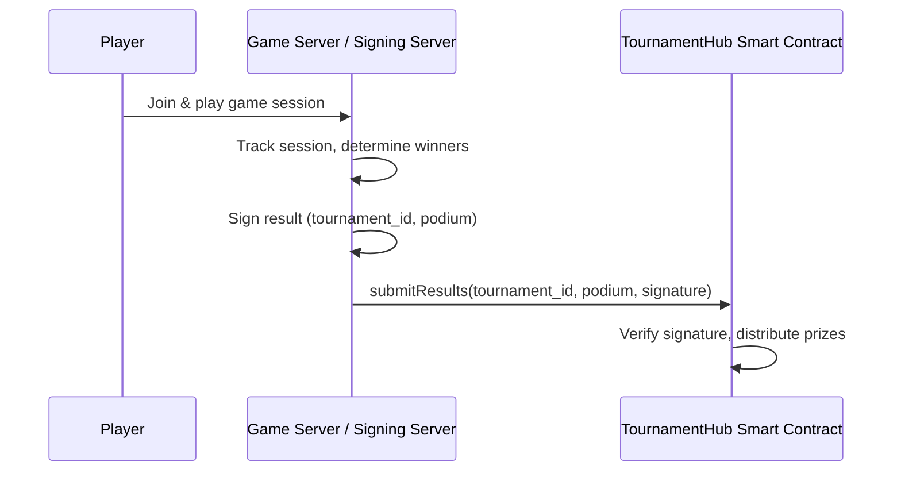
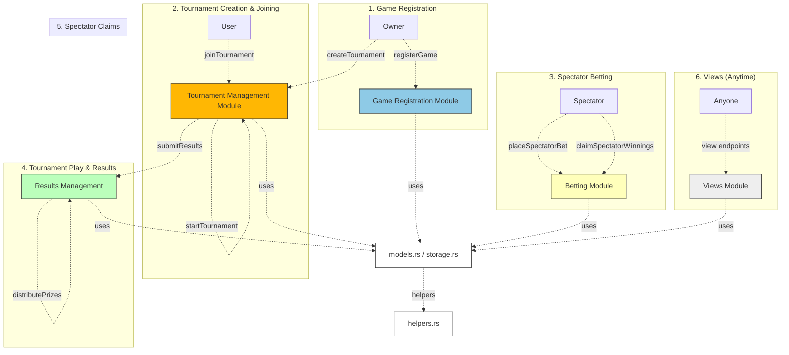

# Tournament Hub Smart Contract

This project implements a modular smart contract for managing tournaments, games, and spectator betting on the MultiversX blockchain. The contract is designed for clarity, maintainability, and extensibility, with logic split into focused modules.

## SC Project Structure

```
tournament-hub-sc/
├── src/
│   ├── helpers.rs              # Private helper functions used across modules
│   ├── models.rs               # Data structures and enums (GameConfig, Tournament, etc.)
│   ├── storage.rs              # Storage mappers for contract state
│   ├── views.rs                # View (query) endpoints
│   ├── tournament_hub.rs       # Main contract trait, only init/upgrade logic and trait composition
│   └── tournament_logic/
│       ├── game_registration.rs      # Game registration endpoints
│       ├── tournament_management.rs # Tournament creation, joining, starting
│       ├── results_management.rs    # Result submission and prize distribution
│       └── spectator_betting.rs     # Spectator betting and claims
└── README.md
```

## Module Overview

- **models.rs**: Contains all core data structures and enums, such as `GameConfig`, `Tournament`, `TournamentStatus`, etc.
- **storage.rs**: Defines storage mappers for persistent contract state (games, tournaments, bets, etc.).
- **helpers.rs**: Private helper functions for internal contract logic (e.g., signature verification, prize distribution).
- **views.rs**: Read-only endpoints for querying contract state (game config, tournament info, bets, etc.).
- **tournament_logic/**: Contains logic modules for each major contract feature:
  - **game_registration.rs**: Endpoints for registering new games (owner only).
  - **tournament_management.rs**: Endpoints for creating, joining, and starting tournaments.
  - **results_management.rs**: Endpoints for submitting results and distributing prizes.
  - **spectator_betting.rs**: Endpoints for placing bets and claiming winnings as a spectator.
- **tournament_hub.rs**: The main contract file. It only contains the contract trait, which composes all modules, and the `init`/`upgrade` functions.

## Key Features

- **Modular Design**: Each logical area is in its own file, making the codebase easy to navigate and extend.
- **Owner-Only Game Registration**: Only the contract owner can register new games.
- **Tournament Lifecycle**: Create, join, and start tournaments with entry fees.
- **Result Submission**: Secure result submission and prize distribution, including house fees and podium splits.
- **Spectator Betting**: Spectators can bet on players, with winnings distributed based on final results.
- **View Endpoints**: Query all relevant contract state for games, tournaments, and bets.

## Game Server / Signing Server Architecture

The Game Server (or Signing Server) is a critical off-chain component that manages multiplayer game sessions and securely submits results to the TournamentHub smart contract.

### Responsibilities
- **Session Management:** Hosts and manages multiplayer game sessions, tracks participants, and enforces game rules.
- **Result Determination:** At the end of a session, determines the final podium (ordered list of winners).
- **Result Signing:** Signs the result data (e.g., tournament ID and podium) with its private key, acting as a trusted attestor.
- **Result Submission:** Submits the signed result to the TournamentHub smart contract via the `submitResults` endpoint.

### Communication Flow
1. **Game Session:** Players join and play a game session managed by the Game Server.
2. **Result Generation:** When the session ends, the server determines the winners and creates a message (e.g., `{tournament_id, podium}`).
3. **Signing:** The server signs the message with its private key. The public key/address is registered in the smart contract as the trusted signer for that game.
4. **Submission:** The server (or a relayer) calls the smart contract's `submitResults` endpoint, providing the tournament ID, podium, and signature.
5. **Verification:** The smart contract verifies the signature and processes payouts if valid.

### Security Considerations
- The server's private key must be kept secure; compromise could allow fraudulent result submissions.
- The public key/address is stored on-chain in the game config, so only results from the trusted server are accepted.
- For advanced setups, the signing server could be a multi-sig or decentralized oracle.

### High-Level Flow Diagram



## How to Extend

- Add new features by creating new modules in `tournament_logic/` or extending existing ones.
- Add new data structures to `models.rs` and new storage mappers to `storage.rs` as needed.
- Keep the main contract file (`tournament_hub.rs`) minimal—only trait composition and lifecycle functions.

---

For more details on each module, see the comments at the top of each file. 

## Flow diagram



## End-to-End Testing Guide

This section provides a complete step-by-step guide for testing the tournament hub system from start to finish, including both the smart contract and the game server.

### Prerequisites

1. **MultiversX SDK**: Install the MultiversX SDK and tools
2. **Python Dependencies**: Install required Python packages for the game server
3. **Wallet Setup**: Have a MultiversX wallet with some test tokens
4. **Contract Deployment**: Deploy the smart contract to testnet/devnet

### Step 1: Setup and Configuration

#### 1.1 Start the Game Server
```bash
cd tournament-hub-game-server
python main.py
```

#### 1.2 Get Server's Public Key and Address
```bash
curl -X GET http://localhost:8000/public_key_pem
```
This returns the server's bech32 address that will be used for game registration.

#### 1.3 Register a Game (One-time setup)
```bash
# Using mxpy interactor
mxpy contract call <CONTRACT_ADDRESS> \
  --function registerGame \
  --args str:game1 str:<SERVER_BECH32_ADDRESS> \
  --gas-limit 10000000 \
  --recall-nonce --send
```

### Step 2: Tournament Creation and Management

#### 2.1 Create a Tournament
```bash
mxpy contract call <CONTRACT_ADDRESS> \
  --function createTournament \
  --args str:game1 u64:1000000000000000000 u64:$(date -d '+1 hour' +%s) u64:$(date -d '+2 hours' +%s) \
  --gas-limit 10000000 \
  --recall-nonce --send
```

#### 2.2 Join Tournament (as players)
```bash
# Player 1 joins
mxpy contract call <CONTRACT_ADDRESS> \
  --function joinTournament \
  --args u64:1 \
  --value 1000000000000000000 \
  --gas-limit 10000000 \
  --recall-nonce --send

# Player 2 joins
mxpy contract call <CONTRACT_ADDRESS> \
  --function joinTournament \
  --args u64:1 \
  --value 1000000000000000000 \
  --gas-limit 10000000 \
  --recall-nonce --send
```

#### 2.3 Start Tournament
```bash
mxpy contract call <CONTRACT_ADDRESS> \
  --function startTournament \
  --args u64:1 \
  --gas-limit 10000000 \
  --recall-nonce --send
```

### Step 3: Game Session and Result Submission

#### 3.1 Start Game Session (Server)
```bash
curl -X POST http://localhost:8000/start_session \
  -H "Content-Type: application/json" \
  -d '{
    "tournament_id": 1,
    "players": ["erd1...", "erd2..."]
  }'
```

#### 3.2 Submit Results (Server)
```bash
curl -X POST http://localhost:8000/submit_results \
  -H "Content-Type: application/json" \
  -d '{
    "tournament_id": 1,
    "podium": ["erd1...", "erd2..."]
  }'
```
This returns a signature that will be used for on-chain submission.

#### 3.3 Submit Results to Smart Contract
```bash
mxpy contract call <CONTRACT_ADDRESS> \
  --function submitResults \
  --args u64:1 str:erd1... str:erd2... str:<SIGNATURE_FROM_SERVER> \
  --gas-limit 10000000 \
  --recall-nonce --send
```

### Step 4: Spectator Betting (Optional)

#### 4.1 Place Spectator Bet
```bash
mxpy contract call <CONTRACT_ADDRESS> \
  --function placeSpectatorBet \
  --args u64:1 str:erd1... \
  --value 500000000000000000 \
  --gas-limit 10000000 \
  --recall-nonce --send
```

#### 4.2 Claim Spectator Winnings (after results)
```bash
mxpy contract call <CONTRACT_ADDRESS> \
  --function claimSpectatorWinnings \
  --args u64:1 \
  --gas-limit 10000000 \
  --recall-nonce --send
```

### Step 5: Verification and Debugging

#### 5.1 Verify Signature Off-Chain
```bash
curl -X POST http://localhost:8000/verify_signature \
  -H "Content-Type: application/json" \
  -d '{
    "tournament_id": 1,
    "podium": ["erd1...", "erd2..."],
    "signature": "<SIGNATURE_FROM_SERVER>"
  }'
```

#### 5.2 Query Contract State
```bash
# Get tournament info
mxpy contract query <CONTRACT_ADDRESS> \
  --function getTournament \
  --args u64:1

# Get game config
mxpy contract query <CONTRACT_ADDRESS> \
  --function getGameConfig \
  --args str:game1

# Get spectator bets
mxpy contract query <CONTRACT_ADDRESS> \
  --function getSpectatorBets \
  --args u64:1
```

### Common Issues and Solutions

#### Issue: "Tournament is not in playing phase"
**Solution**: Make sure to call `startTournament` when the tournament is ready to start.

#### Issue: "ed25519 verify error"
**Causes**:
- Message format mismatch (tournament_id serialization)
- Public key mismatch
- Signature format issues

**Debugging Steps**:
1. Verify the server's public key matches the one registered in the contract
2. Check that tournament_id is serialized as 8 bytes (u64) in both server and contract
3. Use the `/verify_signature` endpoint to test off-chain verification
4. Check the debug events in the contract (if transaction succeeds)

#### Issue: Import conflicts with `signing` package
**Solution**: Uninstall the global `signing` package:
```bash
pip uninstall signing
```

### Testing Checklist

- [ ] Game server starts without errors
- [ ] Game registration succeeds
- [ ] Tournament creation succeeds
- [ ] Players can join tournament
- [ ] Tournament can be started when ready
- [ ] Server can sign results
- [ ] Off-chain signature verification works
- [ ] On-chain result submission succeeds
- [ ] Prizes are distributed correctly
- [ ] Spectator betting works (optional)
- [ ] Spectator winnings can be claimed (optional)

### Performance Testing

For load testing, you can:
1. Create multiple tournaments simultaneously
2. Have many players join tournaments
3. Test concurrent result submissions
4. Verify gas costs remain reasonable

### Security Testing

1. **Unauthorized Access**: Try calling admin functions with non-admin accounts
2. **Signature Forgery**: Submit results with invalid signatures
3. **Replay Attacks**: Try reusing old signatures
4. **Timing Attacks**: Test tournament state transitions
5. **Overflow/Underflow**: Test with extreme values

---

For more detailed information about each component, see the individual module documentation and the game server README.