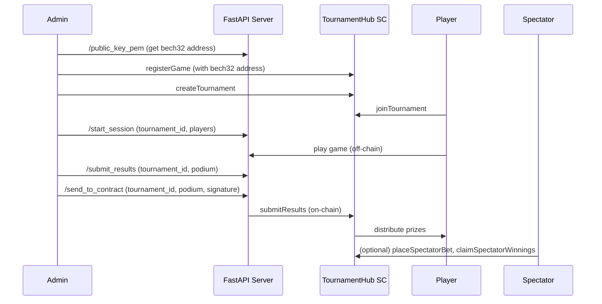

# Tournament Hub Game Server / Signing Server

This component is an off-chain service responsible for managing multiplayer game sessions and securely submitting results to the TournamentHub smart contract.

## Purpose
- Host and manage multiplayer game sessions.
- Determine the final podium (winners) for each tournament.
- Sign the result data with a private key (trusted attestor).
- Submit signed results to the TournamentHub smart contract for prize distribution.

## High-Level Architecture
- **Game Session Management:** Handles player registration, session state, and game logic.
- **Result Generation:** At the end of a session, determines the ordered list of winners.
- **Result Signing:** Signs the result (e.g., `{tournament_id, podium}`) with the server's private key.
- **Smart Contract Integration:** Calls the TournamentHub contract's `submitResults` endpoint with the tournament ID, podium, and signature.

## Integration Flow
1. Players join and play a game session managed by the server.
2. When the session ends, the server determines the winners and creates a message (e.g., `{tournament_id, podium}`).
3. The server signs the message with its private key.
4. The server (or a relayer) submits the result to the TournamentHub smart contract.
5. The contract verifies the signature and distributes prizes if valid.

## Security Notes
- The server's private key must be kept secure. If compromised, an attacker could submit fraudulent results.
- The public key/address is registered in the smart contract as the trusted signer for each game.
- For advanced setups, consider using a multi-sig or decentralized oracle for result attestation.

## Example Flow

## End-to-End Solution Flow

The following diagram illustrates the full flow of the tournament hub solution, including all stakeholders and their interactions:

## Smart Contract Testing Flow

The following table summarizes the main steps for testing the tournament smart contract on the blockchain:

| Step                | Action/Endpoint         | Who Calls It         | Notes                        |
|---------------------|------------------------|----------------------|------------------------------|
| 1. Register Game    | `registerGame`         | Admin                | One-time per game            |
| 2. Create Tournament| `createTournament`     | Admin/Player         |                              |
| 3. Join Tournament  | `joinTournament`       | Each Player          | Before join_deadline         |
| 4. Start Tournament | `startTournament`      | Admin/Anyone         | After join_deadline          |
| 5. Play Game        | Off-chain              | Players/Server       |                              |
| 6. Get Signature    | `/submit_results`      | Server               | Returns signature            |
| 7. Submit Results   | `submitResults`        | Server/Admin         | With signature               |
| 8. Spectator Bets   | `placeSpectatorBet`    | Spectators           | (Optional)                   |
| 9. Claim Winnings   | `claimSpectatorWinnings`| Spectators          | (Optional)                   |

## Next Steps
- Implement a minimal REST API for session management and result submission.
- Add cryptographic signing of results.
- Integrate with the TournamentHub smart contract (submitResults endpoint).
- Add configuration for the signing key and contract address.
- Add logging and error handling. 